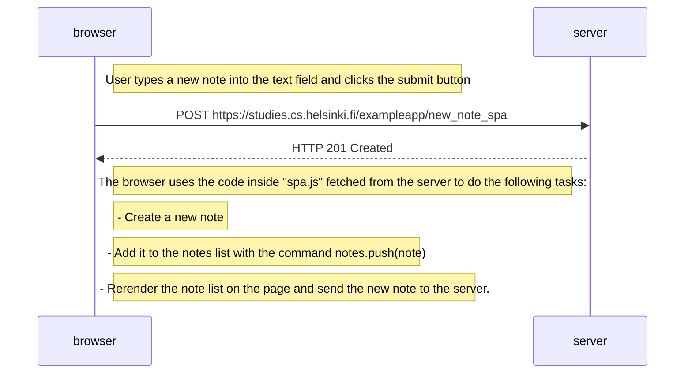

```mermaid
sequenceDiagram
    participant browser
    participant server

    Note right of browser: User types a new note into the text field and clicks the submit button
    browser->>server: POST https://studies.cs.helsinki.fi/exampleapp/new_note_spa
    activate server
    server-->>browser: HTTP 201 Created
    Note right of browser: The browser uses the code inside "spa.js" fetched from the server to do the following tasks:
    Note right of browser: - Create a new note
    Note right of browser: - Add it to the notes list with the command notes.push(note) 
    Note right of browser: - Rerender the note list on the page and send the new note to the server.

```